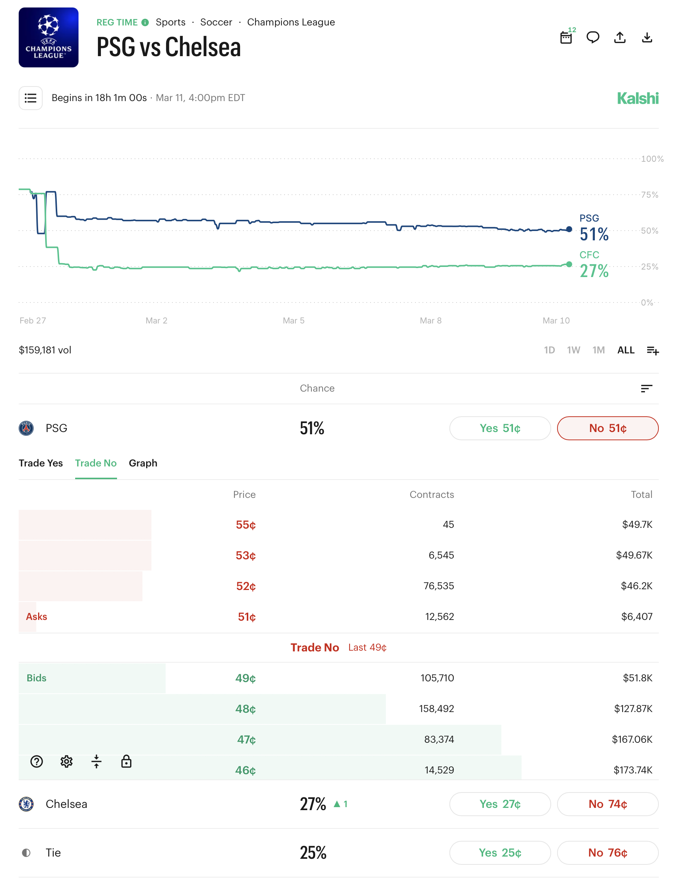
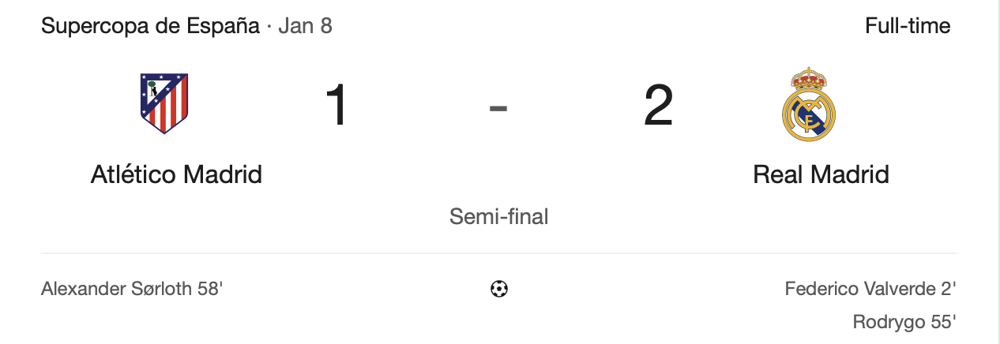
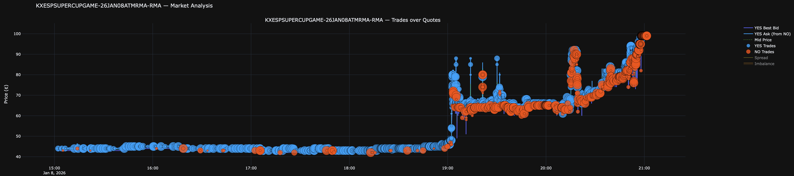
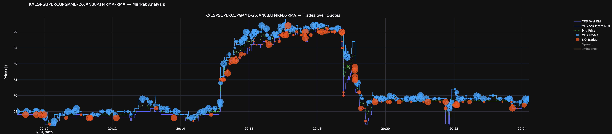
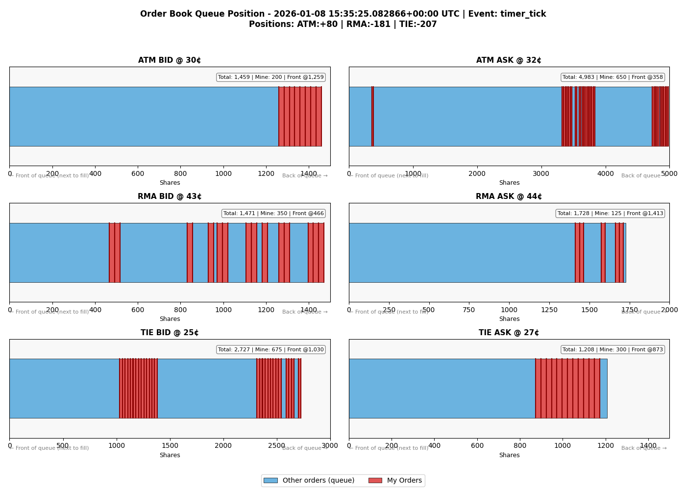
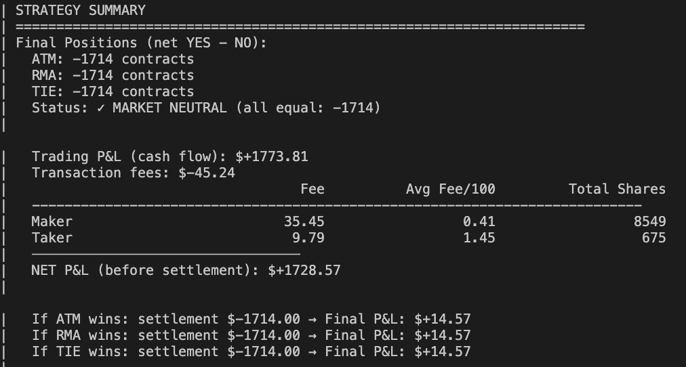
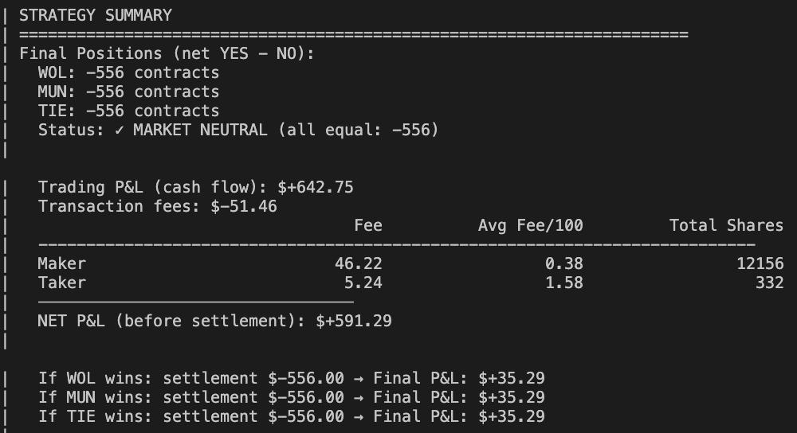

# Automated Market Making on Kalshi soccer games

This repository presents the motivations and results of my project.

There are, for now, two main parts:
- Simulation Framework
- Market Making Algorithm Research

# Concepts
Soccer games have 3 possible outcomes within the 90 minutes of the game: team 1 wins, team 2 wins, or it's a draw. Each outcome is called a "market".

Let's take an example:

	

At the time I'm writing this, the best bid/ask prices are:
| Market | Bid | Ask |
|--------|-----|-----|
| PSG    | 50  | 51  |
| CHE    | 26  | 27  |
| TIE    | 24  | 25  |

There are 2 different ways to make the spread on these markets:
- You sell PSG wins at 51¢, buy PSG wins at 50¢ and you immediately earn 1¢ - ignoring fees for now.
- You sell PSG wins for 51¢, Chelsea wins at 27¢ and Tie at 25¢, you now have $1.03. At the end of the game, you will owe $1 because Kalshi markets settle at $1 if the bet was correct, and you earn 3¢ at settlement. This is one way to earn sort of a "3D" spread.

# Visualizing the makets

Let's look at the game between Atletico Madrid (ATM) and Real Madrid (RMA) that started at 7pm on January 8th 2026.

    

This graph below shows the evolution of the price of the "Real Madrid is going to win" contract. You can see the price jumps when goals get scored.

To understand the graph better, we can zoom:

The sudden jump and fall is due to the 2 goals that happened at the 55th and 58th minutes.

# Approach

Market making during a soccer game requires premium subscriptions to professional data providers like Opta, ESPN or Sportradar, and can cost up to tens of thousand of dollars. Without it, it is very challenging to do anything without taking too many risks as you'll constantly have stale information compared to the hedge funds that are designated market makers.

That's why I chose to focus on the period before soccer games start, that way I can play on equal terms with other market participants.

# Simulation Framework

I built a high-fidelity simulation engine that allows:

- To record Kalshi markets' order books and trades by connecting to the exchange's websocket streams and deliver it to a well organized a data pipeline.
- To replay a game and plug a market making algorithm that interacts with the order books, taking into account the latency of sending and receiving quotes / trade events.

The second point was by far the most challenging one.

This image below shows the interaction between a market making algorithm that I've plugged to the simulation engine and the order books:

    

Each row represent queues of the quotes on the bid (left column) and ask (right column) for the 3 markets ATM, RMA and TIE.

For example, for the contract "Real Madrid is going to win (RMA)", I have 350 shares on the bid and 125 and the ask.

So far, the net position is ATM: +80 | RMA: -181 | TIE: -207.

Note that for all markets, the algorithm sent more shares on the side that make the positions return to neutral.

A couple minutes before the game starts, the algorithm make it so that it has the same number of contracts for every outcome, because it's the best way to eliminate risk completely - to become market neutral. Indeed, if one has -100 contracts (short position) of each outcome that they sold for a total of around $100, they will owe exactly $100 in the end as one of the outcome will settle to $1 per contract.

# Some strategies' results

This is a result of a strategy with some specific parameters for Atletico Madrid vs Real Madrid. Net final P%L is $14.57.

    

Here's another example with same strategy and parameters. The game is Wolverhampton FC - Manchester United on December 8th, 2025. Net final P%L is $14.57.

    

The average Maker fee per 100 share is around 40¢, whereas the Taker fee is around $1.50, so crossing the spread can erase the profits by a lot.

**These are estimated P&Ls based on a simulation.**

Strategy full backtest isn't disclosed here.

# Appendix

Aiming have it ready to trade with real money before the 2026 FIFA World Cup.

This project is for research purposes only.
