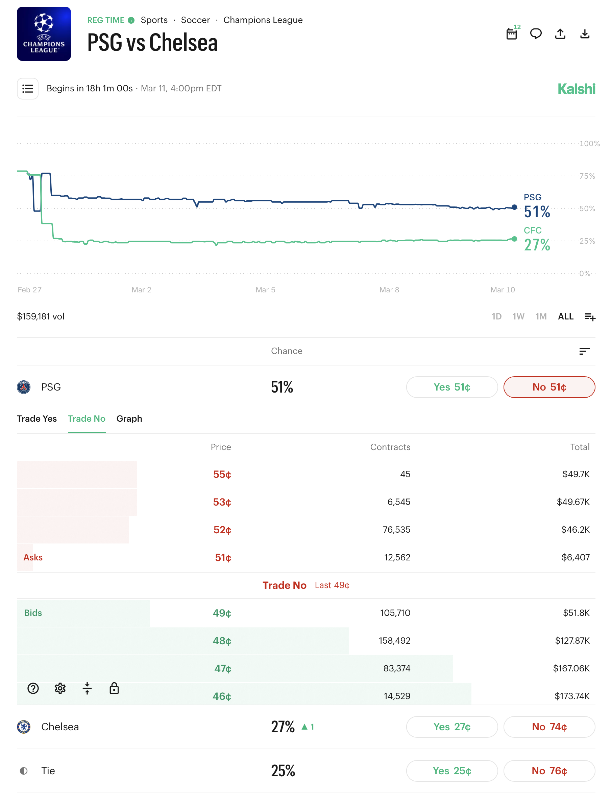
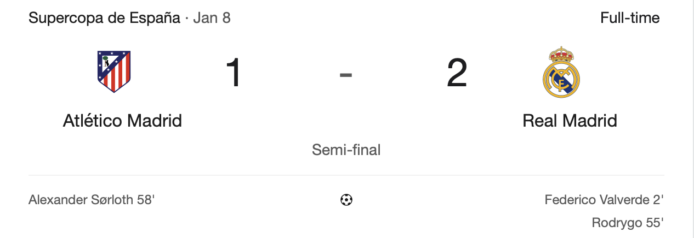
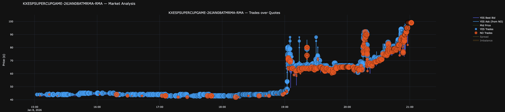
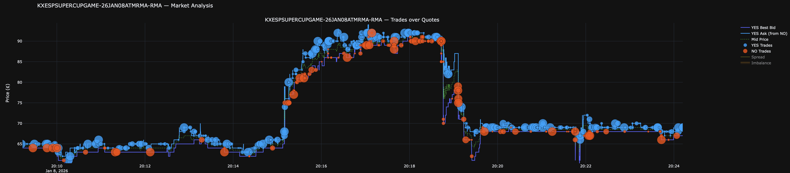
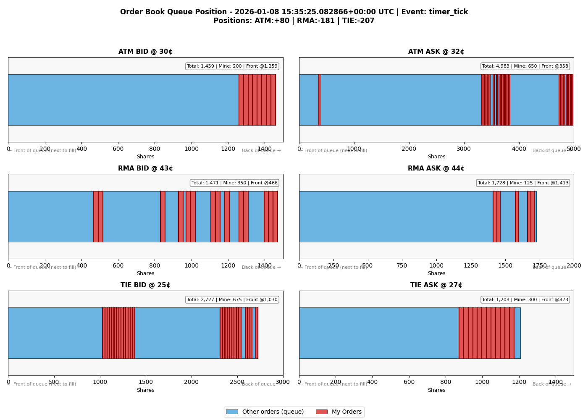
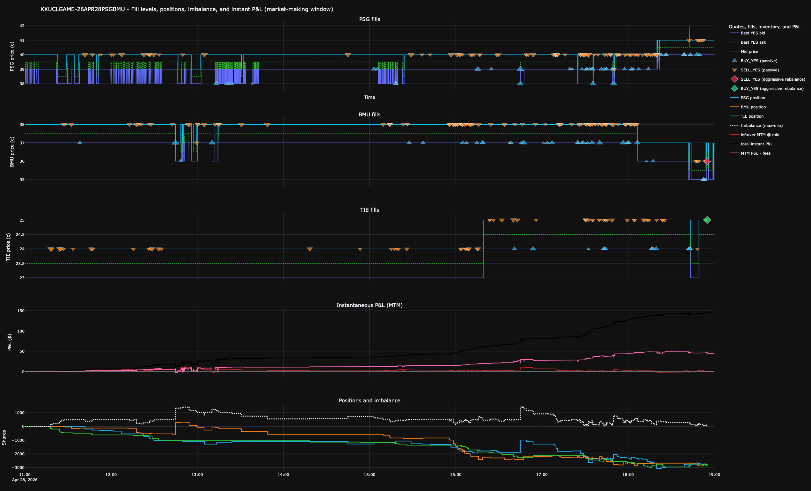

# Automated Market Making on Kalshi Soccer Games

A project summary on automated market making in pre-game soccer prediction markets: real-time data pipeline, high-fidelity replay simulator, and a market-making algorithm tested across out-of-sample games.

> *This project is for research purposes only.*

---

## Concepts

A soccer game has three possible outcomes within regulation time: team 1 wins, team 2 wins, or a draw. Each outcome trades as a separate contract on Kalshi, settling at $1 if correct and $0 otherwise. Each contract has its own order book.

	

For PSG vs Chelsea above, the best bid/ask prices were:

| Market | Bid | Ask |
|--------|-----|-----|
| PSG    | 49  | 51  |
| CHE    | 26  | 27  |
| TIE    | 24  | 25  |

There are two ways to capture the spread on these markets:

- **Single-market spread.** Sell PSG wins at 51¢, buy PSG wins at 49¢, and you immediately earn 2¢ — ignoring fees.
- **3D spread.** Sell PSG wins at 51¢, Chelsea wins at 27¢, and Tie at 25¢. You now have $1.03. At settlement, exactly one of the three contracts pays out $1, so you owe $1 regardless of the result — and you keep 3¢. This is the structural arbitrage that anchors prices across the three correlated contracts.

---

## Visualizing the Markets

To get a feel for how these markets behave, here's the Atletico Madrid vs Real Madrid game on January 8th, 2026:

    

The graph below shows the price of the "Real Madrid wins" contract over the course of the game. You can see the price jump when goals are scored:

Zooming in around the goals scored in the 55th and 58th minutes:

These discrete jumps are the kind of step-function information events that make in-play market making hazardous: anyone without a low-latency event feed sees the goal *after* the price has already moved, and gets adversely selected on stale quotes.

---

## Approach

I chose to focus this project on **pre-game market making** rather than in-play. The reason is structural: in-play market making requires sub-second reactions to goal events and premium data feeds (Opta, Sportradar) that cost tens of thousands of dollars per year. Without them, you're permanently behind the designated liquidity providers and systematically adversely selected on every goal.

Pre-game is a different game. Order flow is dominated by retail price-takers, spreads are wide relative to short-term volatility, and the edge available is structural — queue priority, inventory management, and adverse selection avoidance — rather than informational. It's the same edge that scales to traditional market-making in equities, FX, and crypto.

---

## Simulation Framework

Backtesting market making is fundamentally harder than backtesting directional strategies because the strategy's own orders affect the order book it's trading against. I built a simulator specifically to handle this:

- **Data pipeline.** WebSocket ingestion of Kalshi order books and trades, persisted to Parquet. Millions of events per game, milisecond frequency.
- **Latency modeling.** Every order, cancel, and fill notification is delayed by configurable round-trip latency. The strategy never sees an event before it would have seen it live.
- **Queue position tracking.** FIFO: resting orders go to the back of the queue at their price level and advance only as orders ahead are filled or cancelled.
- **Partial fills and fee accounting.** Trades match against the simulated queue with proportional partial fills. Maker and taker fees applied per Kalshi's published schedule.

The image below shows the simulator state mid-game: the bid (left) and ask (right) queues for the three markets, with the strategy's resting orders in red and other participants in blue.

    

Each row represents the queues of quotes on the best bid (left column) and best ask (right column) for the 3 markets ATM, RMA, and TIE. For example, for the contract "Real Madrid is going to win (RMA)", I have 350 shares on the bid and 125 on the ask.

So far, the net position is ATM: +80 | RMA: -181 | TIE: -207, and note that for all markets, the algorithm sent more shares on the side that makes the positions return to neutral. The logic is way more complex.

---

## Results

> All P&L figures are estimates from simulation.

### Sample game: PSG vs Bayern Munich (April 28th, 2026)

The plot below shows a full pre-game quoting session. Top three panels show passive fills on each market (triangles) and rare aggressive rebalancing trades (diamonds) — passive fills earn the spread, aggressive ones pay it. The fourth panel is the instantaneous mark-to-market P&L. The bottom panel shows positions across the three outcomes converging toward the market-neutral condition before kickoff.

    

The pink curve is the actual MTM P&L. The red curve represents the amount by which the markets move for or against me, and before soccer games there is no information so it stays around 0. **The difference between the pink and the red curves is a real alpha**.

A few things to note:

- **The MTM P&L curve (pink) is monotonically increasing with low variance** — the signature of stead spread capture, not directional risk-taking.
- The three position lines move in tight correlation, converging to a fully hedged state before the game starts.
- The fill stream is overwhelmingly passive (triangles, not diamonds) — the strategy earns the spread rather than paying it.

### Per-game examples

| Game | Date | Net P&L | Maker fees | Taker fees |
|---|---|---|---|---|
| WOL vs MUN | 2025-12-08 | $35.29 | $46.22 | $5.24 |
| INT vs LFC | 2025-12-09 | $46.08 | $63.41 | $1.63 |
| ATM vs RMA | 2026-01-08 | $46.08 | $35.45 | $9.79 |
| PSG vs BMU | 2026-04-28 | $44.98 | $99.91 | $1.38 |

The average maker fee per 100 shares is around 40¢; the taker fee is around $1.50. Crossing the spread is roughly 4× more expensive than providing liquidity, which is why the strategy is designed to minimize aggressive orders.

Note that Designated Market Makers (DMMs) have 0 maker fees, and so this strategy could be a lot more profitable.

I will disclose the strategy full backtest and perfomance metrics in an upcoming update.

---

**Stack.** Python · Polars · DuckDB · WebSockets · Parquet

> *This project is for research purposes only.*
